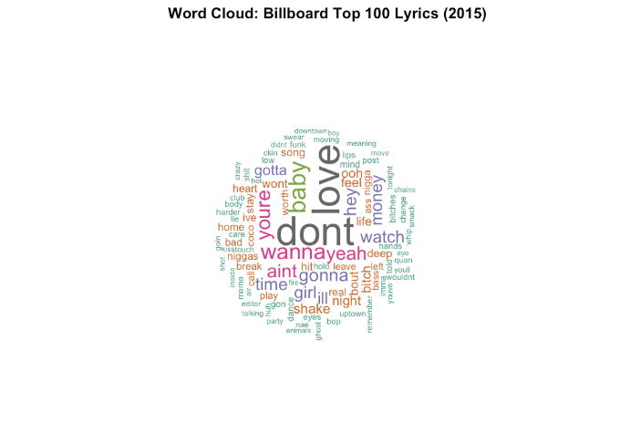

# Data Visualization and Reproducible Research

> Gervonté Fowler 

The following is a sample of products created during the _"Data Visualization and Reproducible Research"_ course.

## Project 01

In the `project_01/` folder you can find an exploration of the evolution of musical characteristics in Billboard summer hits from 1958 to the present. Using data visualization techniques in R, the analysis focuses on key audio features such as danceability, energy, valence, and musical key. The goal is to uncover long-term trends in the emotional tone and rhythmic structure of popular summer music, providing insights into how mainstream music has shifted in response to cultural, technological, and industry changes.
Find the code and report in the `project_01/` folder.
**Sample data visualization:** 

## Project 02

In this project, I explored trends in Netflix shows using a dataset of 1,000 entries containing user rating scores, release years, and rating systems. The goal was to uncover patterns in viewer sentiment, analyze how scores evolved over time, and examine regional influences using mapped rating data. The analysis combines interactive visualizations and a linear regression model to assess temporal and geographic trends in content reception. Find the code and report in the `project_02/` folder.

**Sample data visualization:** 

## Project 03

In this project, I explored two distinct datasets. In Part 1, I analyzed 2022 weather data from Tampa International Airport, creating visualizations such as histograms, density plots with different kernels, faceted monthly density plots, ridgeline plots with quantiles, and precipitation distributions to reveal seasonal patterns and climate variability. In Part 2, I conducted text analysis on Billboard’s Top 100 song lyrics from 2015, using word frequency plots, a word cloud, bigram analysis, sentiment scoring with the AFINN lexicon, and a word network graph to uncover common themes and emotional tones in popular music.

**Sample data visualization:** 

### Moving Forward

Through the completion of these projects, I gained a deeper understanding of how to transform raw data into meaningful visual narratives. I learned how different types of visualizations—such as density plots, ridgeline charts, sentiment histograms, and network graphs—can reveal patterns, context, and emotion in both numerical and textual data. I also improved my ability to write reproducible R Markdown documents, which is essential for clear and transparent data communication. Moving forward, I plan to explore more advanced storytelling techniques using interactive dashboards and animations, and to deepen my understanding of how to apply design principles and statistical thinking to make visual insights more impactful.