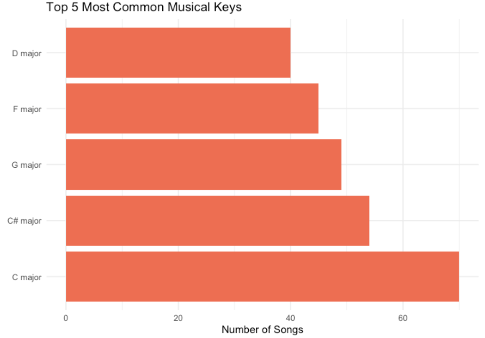
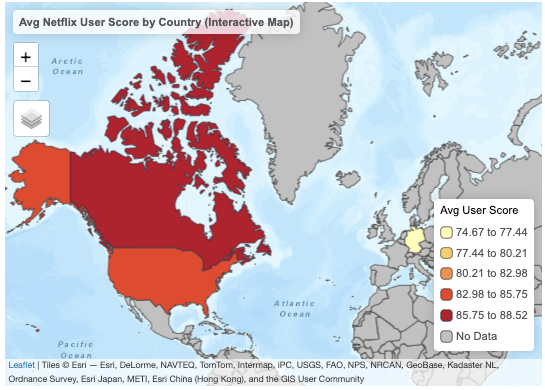

# Data Visualization and Reproducible Research

> Gervonté Fowler. 

The following is a sample of products created during the _"Data Visualization and Reproducible Research"_ course.

## Project 01

In the `project_01/` folder you can find an exploration of the evolution of musical characteristics in Billboard summer hits from 1958 to the present. Using data visualization techniques in R, the analysis focuses on key audio features such as danceability, energy, valence, and musical key. The goal is to uncover long-term trends in the emotional tone and rhythmic structure of popular summer music, providing insights into how mainstream music has shifted in response to cultural, technological, and industry changes.
Find the code and report in the `project_01/` folder.
**Sample data visualization:** 

## Project 02

In this project, I explored trends in Netflix shows using a dataset of 1,000 entries containing user rating scores, release years, and rating systems. The goal was to uncover patterns in viewer sentiment, analyze how scores evolved over time, and examine regional influences using mapped rating data. The analysis combines interactive visualizations and a linear regression model to assess temporal and geographic trends in content reception. Find the code and report in the `project_02/` folder.

**Sample data visualization:** 

## Project 03

In this project, I explored ... _[short description of the data visualizations you for this part of the project produced goes here]_

**Sample data visualization:** 

_[include your favorite visualization from this project here]_

### Moving Forward

_Please add here a short reflection on what you learned and what you plan to continue exploring in terms of data visualization, data storytelling, reproducible research, and/or related topics._
