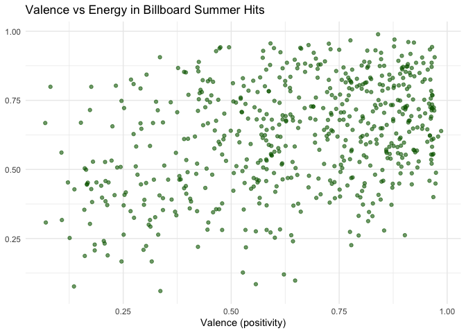

# Data Visualization Project 01


## Introduction

In this revised version of the project, I explored the musical characteristics of **Billboard summer hits** from 1958 to the present. I was particularly interested in how features like *danceability*, *energy*, and *musical key* have changed over time.

### Variable Definitions
- **Danceability**: How suitable a track is for dancing based on tempo, rhythm stability, beat strength, etc.
- **Energy**: A perceptual measure of intensity and activity.
- **Valence**: A measure of musical positiveness.
- **Key Mode**: The pitch class and modality (major or minor) in which a song is composed.


In this project, I explored the musical characteristics of Billboard summer hits from 1958 to the present. I was particularly interested in how features like danceability, energy, and musical key have changed over time.

## Load and Inspect Data


``` r
data <- read_csv("../data/all_billboard_summer_hits.csv")

# Check structure
glimpse(data)
```

```
## Rows: 600
## Columns: 22
## $ danceability     <dbl> 0.518, 0.543, 0.541, 0.408, 0.554, 0.679, 0.663, 0.68…
## $ energy           <dbl> 0.060, 0.332, 0.676, 0.397, 0.189, 0.279, 0.619, 0.55…
## $ key              <chr> "A#", "C", "C", "A", "E", "G", "F#", "B", "C", "G", "…
## $ loudness         <dbl> -14.887, -11.573, -7.988, -12.536, -14.277, -10.386, …
## $ mode             <chr> "major", "major", "major", "major", "major", "major",…
## $ speechiness      <dbl> 0.0441, 0.0317, 0.1350, 0.0300, 0.0279, 0.0384, 0.033…
## $ acousticness     <dbl> 0.9870, 0.6690, 0.1880, 0.8730, 0.9150, 0.6450, 0.336…
## $ instrumentalness <dbl> 7.87e-06, 0.00e+00, 8.03e-01, 0.00e+00, 1.37e-05, 0.0…
## $ liveness         <dbl> 0.1610, 0.1340, 0.1230, 0.2800, 0.1320, 0.1180, 0.062…
## $ valence          <dbl> 0.336, 0.795, 0.911, 0.697, 0.214, 0.854, 0.979, 0.86…
## $ tempo            <dbl> 127.870, 154.999, 76.231, 72.615, 136.714, 117.287, 1…
## $ track_uri        <chr> "006Ndmw2hHxvnLbJsBFnPx", "5ayybTSXNwcarDtxQKqvWX", "…
## $ duration_ms      <dbl> 216373, 153933, 128360, 162773, 165293, 161253, 15060…
## $ time_signature   <dbl> 4, 4, 4, 4, 3, 3, 4, 4, 4, 4, 3, 4, 4, 4, 4, 4, 4, 3,…
## $ key_mode         <chr> "A# major", "C major", "C major", "A major", "E major…
## $ playlist_name    <chr> "summer_hits_1958", "summer_hits_1958", "summer_hits_…
## $ playlist_img     <chr> "https://mosaic.scdn.co/640/5e8c49f7a8d161c1d6510999b…
## $ track_name       <chr> "Nel blu dipinto di blu", "Poor Little Fool", "Patric…
## $ artist_name      <chr> "Domenico Modugno", "Ricky Nelson", "Pérez Prado", "T…
## $ album_name       <chr> "Tutto Modugno (Mister Volare)", "Ricky Nelson (Expan…
## $ album_img        <chr> "https://i.scdn.co/image/5e8c49f7a8d161c1d6510999bd86…
## $ year             <dbl> 1958, 1958, 1958, 1958, 1958, 1958, 1958, 1958, 1958,…
```

``` r
# Check for missing values
colSums(is.na(data))
```

```
##     danceability           energy              key         loudness 
##                0                0                0                0 
##             mode      speechiness     acousticness instrumentalness 
##                0                0                0                0 
##         liveness          valence            tempo        track_uri 
##                0                0                0                0 
##      duration_ms   time_signature         key_mode    playlist_name 
##                0                0                0                0 
##     playlist_img       track_name      artist_name       album_name 
##                0                0                0                0 
##        album_img             year 
##                0                0
```

``` r
# Summary of numerical features
summary(select(data, danceability, energy, valence, tempo, year))
```

```
##   danceability        energy          valence           tempo       
##  Min.   :0.2170   Min.   :0.0600   Min.   :0.0695   Min.   : 62.83  
##  1st Qu.:0.5457   1st Qu.:0.4768   1st Qu.:0.4790   1st Qu.:100.22  
##  Median :0.6480   Median :0.6405   Median :0.6900   Median :120.01  
##  Mean   :0.6407   Mean   :0.6221   Mean   :0.6488   Mean   :120.48  
##  3rd Qu.:0.7402   3rd Qu.:0.7830   3rd Qu.:0.8482   3rd Qu.:133.84  
##  Max.   :0.9800   Max.   :0.9890   Max.   :0.9860   Max.   :210.75  
##       year     
##  Min.   :1958  
##  1st Qu.:1973  
##  Median :1988  
##  Mean   :1988  
##  3rd Qu.:2002  
##  Max.   :2017
```

From the output above, I looked for missing values or extreme outliers. Most features appear to be well-structured with limited missing data.

## Data Cleaning and Transformation


``` r
# Convert year to integer and remove NA years
data <- data %>%
  mutate(year = as.integer(year)) %>%
  filter(!is.na(year))
```

Here I converted the year into a usable numeric format, removed missing year values.

## Danceability Over Time


``` r
danceability_summary <- data %>%
  group_by(year) %>%
  summarize(avg_danceability = mean(danceability, na.rm = TRUE))

ggplot(danceability_summary, aes(x = year, y = avg_danceability)) +  
  geom_line(color = "steelblue", size = 1) +
  labs(title = "Average Danceability of Summer Hits Over Time",
       x = "Year", y = NULL) +  
  theme_minimal() +
  annotate("text", x = 2010, y = 0.75, label = "Rise of EDM & Pop", hjust = 0, size = 2.5)
```

<!-- -->

This chart helped me observe that summer hits have generally become more danceable over the decades, especially since the 2000s. Danceability is a key audio feature when evaluating the physical and social appeal of popular music, particularly in seasonal contexts like summer. 

## Most Common Keys in Summer Hits


``` r
key_counts <- data %>%
  count(key_mode, sort = TRUE) %>%
  top_n(5)

ggplot(key_counts, aes(x = reorder(key_mode, -n), y = n)) +
  geom_bar(stat = "identity", fill = "tomato") +
  coord_flip() +
  labs(title = "Top 5 Most Common Musical Keys",
       x = NULL, y = "Number of Songs") +
  theme_minimal() 
```

<!-- -->

I used this bar chart to see which musical keys were most common. I found that major keys especially C major and G major dominate the landscape of summer hits. This analysis was motivated by the idea that musical key contributes to the overall mood and emotional accessibility of a song. Major keys are often associated with happiness, brightness, and optimism qualities that align with the energetic and feel good nature of summer anthems. 

## Valence vs Energy


``` r
ggplot(data, aes(x = valence, y = energy)) +
  geom_point(alpha = 0.6, color = "darkgreen") +
  labs(title = "Valence vs Energy in Billboard Summer Hits",
       x = "Valence (positivity)", y = NULL) +
  theme_minimal() 
```

<!-- -->

As we mentioned earlier Valence is a measure of the musical positivity conveyed by a track, ranging from 0.0 (sad, negative) to 1.0 (happy, euphoric). High valence songs tend to sound cheerful and emotionally uplifting, while low valence songs are more somber or tense. When paired with energy a measure of intensity and activity we can better understand the emotional tone and dynamism of each track.

This scatterplot allowed me to examine the emotional tone of songs. I noticed that many summer hits are both high energy and high valence fitting the fun, upbeat nature of summer music.

## Conclusion

### Analytical Reflection
This analysis suggests a trend toward increasingly high-energy, emotionally positive music in summer hits, potentially reflecting broader cultural shifts. The dominance of major keys and higher danceability scores post 2000 hints at a preference for more accessible, upbeat music during the summer season.

Through this project, I was able to uncover how the "sound" of summer has evolved. I found that recent summer hits are more rhythmically engaging, often use major keys, and tend to be energetic and joyful. These characteristics help explain why these songs continue to resonate with audiences year after year.
