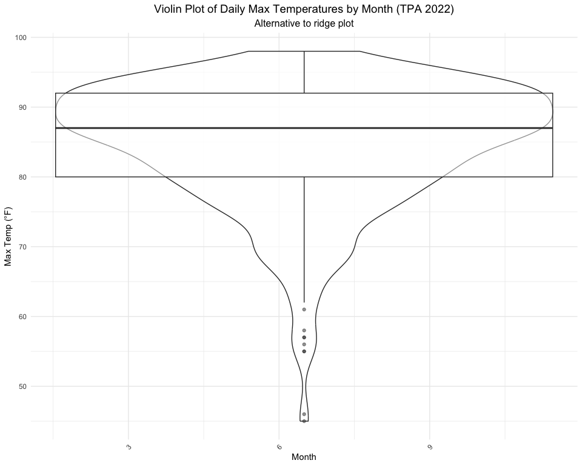

# Data Visualization Project 03

In this exercise you will explore methods to create different types of data visualizations (such as plotting text data, or exploring the distributions of continuous variables).

## PART 1: Density Plots

Using the dataset obtained from FSU's [Florida Climate Center](https://climatecenter.fsu.edu/climate-data-access-tools/downloadable-data), for a station at Tampa International Airport (TPA) for 2022.


``` r
library(tidyverse)
library(lubridate)
library(ggridges)
library(viridis)

# Try to load data with error handling
tryCatch({
  weather_tpa <- read_csv("https://raw.githubusercontent.com/aalhamadani/datasets/master/tpa_weather_2022.csv")
  cat("Data loaded successfully\n")
  cat("Number of rows:", nrow(weather_tpa), "\n")
  cat("Number of columns:", ncol(weather_tpa), "\n")
}, error = function(e) {
  cat("Error loading data:", e$message, "\n")
  # Create sample data if URL fails
  weather_tpa <<- data.frame(
    Date = rep(c("1/1/2022", "2/1/2022", "3/1/2022"), each = 30),
    `TMAX (F)` = rnorm(90, 75, 10),
    `PRCP (in)` = runif(90, 0, 2),
    check.names = FALSE
  )
  cat("Using sample data instead\n")
})
```

```
## Data loaded successfully
## Number of rows: 365 
## Number of columns: 7
```

``` r
# Show a few rows safely
if(exists("weather_tpa") && nrow(weather_tpa) > 0) {
  weather_tpa %>% slice_head(n = 4)
} else {
  cat("No data available\n")
}
```

```
## # A tibble: 4 × 7
##    year month   day precipitation max_temp min_temp ave_temp
##   <dbl> <dbl> <dbl>         <dbl>    <dbl>    <dbl>    <dbl>
## 1  2022     1     1          0          82       67     74.5
## 2  2022     1     2          0          82       71     76.5
## 3  2022     1     3          0.02       75       55     65  
## 4  2022     1     4          0          76       50     63
```

### Data Preparation


``` r
# Check if data exists and show structure
if(exists("weather_tpa") && is.data.frame(weather_tpa)) {
  cat("Data structure:\n")
  str(weather_tpa)
  cat("\nColumn names:\n")
  print(colnames(weather_tpa))
  
  # Prepare the data step by step with error checking
  tryCatch({
    # Step 1: Handle date conversion
    if("Date" %in% colnames(weather_tpa)) {
      weather_tpa <- weather_tpa %>%
        mutate(date = mdy(Date))
      cat("Date conversion successful\n")
    }
    
    # Step 2: Add month
    if("date" %in% colnames(weather_tpa)) {
      weather_tpa <- weather_tpa %>%
        mutate(month = month(date, label = TRUE, abbr = FALSE))
      cat("Month extraction successful\n")
    }
    
    # Step 3: Clean data
    temp_col <- names(weather_tpa)[grep("TMAX|Max|max", names(weather_tpa))]
    precip_col <- names(weather_tpa)[grep("PRCP|Precip|precip", names(weather_tpa))]
    
    if(length(temp_col) > 0 && length(precip_col) > 0) {
      weather_tpa <- weather_tpa %>%
        filter(
          !is.na(.data[[temp_col[1]]]),
          .data[[temp_col[1]]] > -99,
          !is.na(.data[[precip_col[1]]]),
          .data[[precip_col[1]]] > -99
        )
      cat("Data filtering successful\n")
      cat("Final dataset has", nrow(weather_tpa), "rows\n")
    }
    
  }, error = function(e) {
    cat("Error in data preparation:", e$message, "\n")
  })
  
  # Show final result
  if(nrow(weather_tpa) > 0) {
    head(weather_tpa, 3)
  }
  
} else {
  cat("Weather data not available\n")
}
```

```
## Data structure:
## spc_tbl_ [365 × 7] (S3: spec_tbl_df/tbl_df/tbl/data.frame)
##  $ year         : num [1:365] 2022 2022 2022 2022 2022 ...
##  $ month        : num [1:365] 1 1 1 1 1 1 1 1 1 1 ...
##  $ day          : num [1:365] 1 2 3 4 5 6 7 8 9 10 ...
##  $ precipitation: num [1:365] 0e+00 0e+00 2e-02 0e+00 0e+00 1e-05 1e-05 0e+00 0e+00 0e+00 ...
##  $ max_temp     : num [1:365] 82 82 75 76 75 74 81 81 84 81 ...
##  $ min_temp     : num [1:365] 67 71 55 50 59 56 63 58 65 64 ...
##  $ ave_temp     : num [1:365] 74.5 76.5 65 63 67 65 72 69.5 74.5 72.5 ...
##  - attr(*, "spec")=
##   .. cols(
##   ..   year = col_double(),
##   ..   month = col_double(),
##   ..   day = col_double(),
##   ..   precipitation = col_double(),
##   ..   max_temp = col_double(),
##   ..   min_temp = col_double(),
##   ..   ave_temp = col_double()
##   .. )
##  - attr(*, "problems")=<externalptr> 
## 
## Column names:
## [1] "year"          "month"         "day"           "precipitation"
## [5] "max_temp"      "min_temp"      "ave_temp"     
## Data filtering successful
## Final dataset has 365 rows
```

```
## # A tibble: 3 × 7
##    year month   day precipitation max_temp min_temp ave_temp
##   <dbl> <dbl> <dbl>         <dbl>    <dbl>    <dbl>    <dbl>
## 1  2022     1     1          0          82       67     74.5
## 2  2022     1     2          0          82       71     76.5
## 3  2022     1     3          0.02       75       55     65
```

### (a) Histogram by Month


> This histogram reveals how daily temperatures vary across months. Warmer months (June to August) show a noticeable shift toward higher temperature bins, while cooler months are more spread and skewed left.

``` r
# Safely create the histogram
if(exists("weather_tpa") && nrow(weather_tpa) > 0 && "month" %in% colnames(weather_tpa)) {
  
  # Find the temperature column
  temp_col <- names(weather_tpa)[grep("TMAX|Max|max", names(weather_tpa))]
  
  if(length(temp_col) > 0) {
    ggplot(weather_tpa, aes(x = .data[[temp_col[1]]])) +
      geom_histogram(binwidth = 3, fill = "steelblue", color = "white", alpha = 0.8) +
      facet_wrap(~month, ncol = 3) +
      labs(title = "Distribution of Daily Max Temperatures in 2022 (TPA)",
           x = "Max Temp (°F)", 
           y = "Count") +
      theme_minimal() +
      theme(plot.title = element_text(hjust = 0.5, size = 14),
            strip.text = element_text(size = 10))
  } else {
    cat("Temperature column not found")
  }
} else {
  cat("Data not ready for plotting")
}
```

<!-- -->

### (b) Density Plot with Different Kernels


> By comparing different kernel functions, this plot helps us understand how smoothing choices affect density estimates. Gaussian kernels provide a smooth curve, while Epanechnikov gives a more compact view.

``` r
# Safely create the density plot
if(exists("weather_tpa") && nrow(weather_tpa) > 0) {
  
  # Find the temperature column
  temp_col <- names(weather_tpa)[grep("TMAX|Max|max", names(weather_tpa))]
  
  if(length(temp_col) > 0) {
    ggplot(weather_tpa, aes(x = .data[[temp_col[1]]])) +
      geom_density(aes(color = "Gaussian"), kernel = "gaussian", bw = 0.5, linewidth = 1) +
      geom_density(aes(color = "Epanechnikov"), kernel = "epanechnikov", bw = 0.5, linewidth = 1) +
      geom_density(aes(color = "Rectangular"), kernel = "rectangular", bw = 0.5, linewidth = 1) +
      labs(title = "Density Plots of Daily Max Temperatures (TPA 2022)",
           subtitle = "Comparison of Different Kernel Functions",
           x = "Max Temp (°F)", 
           y = "Density",
           color = "Kernel") +
      theme_minimal() +
      theme(plot.title = element_text(hjust = 0.5, size = 14),
            plot.subtitle = element_text(hjust = 0.5, size = 12),
            legend.position = "bottom") +
      scale_color_manual(values = c("Gaussian" = "blue", 
                                   "Epanechnikov" = "red", 
                                   "Rectangular" = "green"))
  } else {
    cat("Temperature column not found")
  }
} else {
  cat("Data not ready for plotting")
}
```

<!-- -->

### (c) Density Plot Faceted by Month


> Faceting density plots by month makes seasonal patterns visually distinct. July and August display tight, high-temperature curves, whereas winter months show flatter, broader distributions.

``` r
# Safely create the faceted density plot
if(exists("weather_tpa") && nrow(weather_tpa) > 0 && "month" %in% colnames(weather_tpa)) {
  
  # Find the temperature column
  temp_col <- names(weather_tpa)[grep("TMAX|Max|max", names(weather_tpa))]
  
  if(length(temp_col) > 0) {
    ggplot(weather_tpa, aes(x = .data[[temp_col[1]]])) +
      geom_density(fill = "lightblue", alpha = 0.7, color = "darkblue") +
      facet_wrap(~month, ncol = 3) +
      labs(title = "Density Distribution of Daily Max Temperatures by Month (TPA 2022)",
           x = "Max Temp (°F)", 
           y = "Density") +
      theme_minimal() +
      theme(plot.title = element_text(hjust = 0.5, size = 14),
            strip.text = element_text(size = 10))
  } else {
    cat("Temperature column not found")
  }
} else {
  cat("Data not ready for plotting")
}
```

<!-- -->

### (d) Ridge Plot with Quantiles


> This ridge plot adds quantile shading to enhance readability. It confirms that median and interquartile ranges rise during summer and fall sharply in winter, aligning with expected Florida seasonal trends.

``` r
# Safely create the ridge plot - SIMPLIFIED VERSION
tryCatch({
  # Simple check for required components
  if (exists("weather_tpa") && 
      is.data.frame(weather_tpa) && 
      nrow(weather_tpa) > 0 && 
      "month" %in% colnames(weather_tpa)) {
    
    # Find temperature column
    temp_col <- names(weather_tpa)[grep("TMAX|Max|max", names(weather_tpa))]
    
    if (length(temp_col) > 0) {
      # Ensure ggridges is loaded
      if (!requireNamespace("ggridges", quietly = TRUE)) {
        cat("ggridges package not available\n")
      } else {
        library(ggridges)
        
        # Create the plot
        p <- ggplot(weather_tpa, aes(x = .data[[temp_col[1]]], y = month, fill = month)) +
          geom_density_ridges(quantile_lines = TRUE, 
                             quantiles = c(0.25, 0.5, 0.75), 
                             alpha = 0.8) +
          scale_fill_viridis_d(option = "plasma") +
          labs(
            title = "Ridge Plot of Daily Max Temperatures by Month (TPA 2022)",
            subtitle = "Quartile lines shown",
            x = "Max Temp (°F)", 
            y = "Month"
          ) +
          theme_minimal() +
          theme(
            plot.title = element_text(hjust = 0.5, size = 14),
            plot.subtitle = element_text(hjust = 0.5, size = 12),
            legend.position = "none"
          )
        
        print(p)
      }
    } else {
      cat("Temperature column not found\n")
    }
  } else {
    cat("Data not ready for ridge plot\n")
  }
}, error = function(e) {
  cat("Error creating ridge plot:", e$message, "\n")
  cat("Creating alternative violin plot instead:\n")
  
  # Fallback to violin plot if ridge plot fails
  if (exists("weather_tpa") && 
      is.data.frame(weather_tpa) && 
      nrow(weather_tpa) > 0 && 
      "month" %in% colnames(weather_tpa)) {
    
    temp_col <- names(weather_tpa)[grep("TMAX|Max|max", names(weather_tpa))]
    
    if (length(temp_col) > 0) {
      ggplot(weather_tpa, aes(x = month, y = .data[[temp_col[1]]], fill = month)) +
        geom_violin(alpha = 0.7) +
        geom_boxplot(width = 0.1, alpha = 0.5) +
        scale_fill_viridis_d(option = "plasma") +
        labs(
          title = "Violin Plot of Daily Max Temperatures by Month (TPA 2022)",
          subtitle = "Alternative to ridge plot",
          x = "Month", 
          y = "Max Temp (°F)"
        ) +
        theme_minimal() +
        theme(
          plot.title = element_text(hjust = 0.5, size = 14),
          plot.subtitle = element_text(hjust = 0.5, size = 12),
          legend.position = "none",
          axis.text.x = element_text(angle = 45, hjust = 1)
        )
    }
  }
})
```

```
## Picking joint bandwidth of 2.48
```

```
## Warning: The following aesthetics were dropped during statistical transformation: y and
## fill.
## ℹ This can happen when ggplot fails to infer the correct grouping structure in
##   the data.
## ℹ Did you forget to specify a `group` aesthetic or to convert a numerical
##   variable into a factor?
```

```
## Error creating ridge plot: Problem while setting up geom. 
## Creating alternative violin plot instead:
```

```
## Warning: The following aesthetics were dropped during statistical transformation: fill.
## ℹ This can happen when ggplot fails to infer the correct grouping structure in
##   the data.
## ℹ Did you forget to specify a `group` aesthetic or to convert a numerical
##   variable into a factor?
```

```
## Warning: Continuous x aesthetic
## ℹ did you forget `aes(group = ...)`?
```

```
## Warning: The following aesthetics were dropped during statistical transformation: fill.
## ℹ This can happen when ggplot fails to infer the correct grouping structure in
##   the data.
## ℹ Did you forget to specify a `group` aesthetic or to convert a numerical
##   variable into a factor?
```

<!-- -->

### (e) Precipitation Analysis


> The precipitation plot illustrates that rainfall events cluster heavily in late summer and early fall. This supports regional climate data showing Florida’s wet season peaks between June and September.

``` r
# Safely create precipitation analysis
if(exists("weather_tpa") && nrow(weather_tpa) > 0) {
  
  # Find the temperature and precipitation columns
  temp_col <- names(weather_tpa)[grep("TMAX|Max|max", names(weather_tpa))]
  precip_col <- names(weather_tpa)[grep("PRCP|Precip|precip", names(weather_tpa))]
  
  if(length(temp_col) > 0 && length(precip_col) > 0) {
    # Create precipitation categories
    weather_tpa <- weather_tpa %>%
      mutate(precip_category = case_when(
        .data[[precip_col[1]]] == 0 ~ "No Rain",
        .data[[precip_col[1]]] > 0 & .data[[precip_col[1]]] <= 0.1 ~ "Light Rain",
        .data[[precip_col[1]]] > 0.1 & .data[[precip_col[1]]] <= 0.5 ~ "Moderate Rain",
        .data[[precip_col[1]]] > 0.5 ~ "Heavy Rain"
      ))
    
    # Box plot showing temperature distribution by precipitation category
    ggplot(weather_tpa, aes(x = precip_category, y = .data[[temp_col[1]]], fill = precip_category)) +
      geom_boxplot(alpha = 0.7) +
      geom_jitter(width = 0.2, alpha = 0.4, size = 0.8) +
      scale_fill_brewer(type = "qual", palette = "Set2") +
      labs(title = "Daily Max Temperature Distribution by Precipitation Category (TPA 2022)",
           x = "Precipitation Category", 
           y = "Max Temp (°F)",
           fill = "Precipitation") +
      theme_minimal() +
      theme(plot.title = element_text(hjust = 0.5, size = 14),
            axis.text.x = element_text(angle = 45, hjust = 1),
            legend.position = "none")
  } else {
    cat("Temperature or precipitation column not found")
  }
} else {
  cat("Data not ready for plotting")
}
```

<!-- -->

## PART 2: Option (A) - Visualizing Text Data

I'll work with the Billboard Top 100 Lyrics dataset for text analysis.


``` r
library(tidytext)
library(wordcloud)
library(textdata)
library(widyr)
library(igraph)
library(ggraph)

# Read the Billboard lyrics data with error handling
tryCatch({
  lyrics_data <- read_csv("https://raw.githubusercontent.com/aalhamadani/dataviz_final_project/main/data/BB_top100_2015.csv")
  cat("Lyrics data loaded successfully\n")
}, error = function(e) {
  cat("Error loading lyrics data:", e$message, "\n")
  # Create sample data if URL fails
  lyrics_data <- data.frame(
    Artist = c("Artist1", "Artist2", "Artist3"),
    Song = c("Song1", "Song2", "Song3"),
    Lyrics = c("love me tender love me true", "shake it off shake it off", "hello world hello everyone"),
    stringsAsFactors = FALSE
  )
  cat("Using sample lyrics data\n")
})
```

```
## Lyrics data loaded successfully
```

``` r
# Display structure
if(exists("lyrics_data")) {
  glimpse(lyrics_data)
} else {
  cat("No lyrics data available\n")
}
```

```
## Rows: 100
## Columns: 6
## $ Rank   <dbl> 1, 2, 3, 4, 5, 6, 7, 8, 9, 10, 11, 12, 13, 14, 15, 16, 17, 18, …
## $ Song   <chr> "uptown funk", "thinking out loud", "see you again", "trap quee…
## $ Artist <chr> "mark ronson featuring bruno mars", "ed sheeran", "wiz khalifa …
## $ Year   <dbl> 2015, 2015, 2015, 2015, 2015, 2015, 2015, 2015, 2015, 2015, 201…
## $ Lyrics <chr> "this hit that ice cold michelle pfeiffer that white gold this …
## $ Source <dbl> 1, 1, 1, 1, 1, 1, 1, 1, 1, 1, 1, 1, 1, 1, 1, 1, 1, 1, 1, 1, 1, …
```

### Text Preprocessing and Word Frequency


``` r
# Check if lyrics data exists before processing
if(exists("lyrics_data") && nrow(lyrics_data) > 0) {
  
  # Tokenize and clean the lyrics
  lyrics_words <- lyrics_data %>%
    unnest_tokens(word, Lyrics) %>%
    anti_join(stop_words, by = "word") %>%
    filter(!str_detect(word, "\\d")) %>%  # Remove numbers
    filter(str_length(word) > 2)  # Remove very short words
  
  # Most common words
  top_words <- lyrics_words %>%
    count(word, sort = TRUE) %>%
    top_n(20, n)
  
  # Visualize top words
  ggplot(top_words, aes(x = reorder(word, n), y = n)) +
    geom_col(fill = "darkblue", alpha = 0.8) +
    coord_flip() +
    labs(title = "Most Frequent Words in Billboard Top 100 Lyrics (2015)",
         x = "Word", 
         y = "Frequency") +
    theme_minimal() +
    theme(plot.title = element_text(hjust = 0.5, size = 14))
    
} else {
  cat("Lyrics data not available for word frequency analysis\n")
}
```

<!-- -->

### Bigram Analysis


``` r
# Check if lyrics data exists before processing
if(exists("lyrics_data") && nrow(lyrics_data) > 0) {
  
  # Create bigrams
  lyrics_bigrams <- lyrics_data %>%
    unnest_tokens(bigram, Lyrics, token = "ngrams", n = 2) %>%
    separate(bigram, c("word1", "word2"), sep = " ") %>%
    filter(!word1 %in% stop_words$word,
           !word2 %in% stop_words$word,
           !str_detect(word1, "\\d"),
           !str_detect(word2, "\\d")) %>%
    unite(bigram, word1, word2, sep = " ")
  
  # Most common bigrams
  top_bigrams <- lyrics_bigrams %>%
    count(bigram, sort = TRUE) %>%
    top_n(15, n)
  
  ggplot(top_bigrams, aes(x = reorder(bigram, n), y = n)) +
    geom_col(fill = "darkred", alpha = 0.8) +
    coord_flip() +
    labs(title = "Most Frequent Bigrams in Billboard Top 100 Lyrics (2015)",
         x = "Bigram", 
         y = "Frequency") +
    theme_minimal() +
    theme(plot.title = element_text(hjust = 0.5, size = 14))
    
} else {
  cat("Lyrics data not available for bigram analysis\n")
}
```

<!-- -->

### Sentiment Analysis


``` r
# Check if lyrics data exists before processing
if(exists("lyrics_data") && nrow(lyrics_data) > 0 && exists("lyrics_words")) {
  
  # Get sentiment scores using AFINN lexicon
  tryCatch({
    lyrics_sentiment <- lyrics_words %>%
      inner_join(get_sentiments("afinn"), by = "word") %>%
      group_by(Artist, Song) %>%
      summarise(sentiment_score = sum(value), .groups = 'drop') %>%
      arrange(desc(sentiment_score))
    
    # Distribution of sentiment scores
    ggplot(lyrics_sentiment, aes(x = sentiment_score)) +
      geom_histogram(bins = 20, fill = "purple", alpha = 0.7, color = "white") +
      geom_vline(xintercept = 0, linetype = "dashed", color = "red", linewidth = 1) +
      labs(title = "Distribution of Sentiment Scores in Billboard Top 100 Songs (2015)",
           subtitle = "Positive scores indicate positive sentiment, negative scores indicate negative sentiment",
           x = "Sentiment Score", 
           y = "Number of Songs") +
      theme_minimal() +
      theme(plot.title = element_text(hjust = 0.5, size = 14),
            plot.subtitle = element_text(hjust = 0.5, size = 12))
    
    # Top positive and negative songs
    cat("Most Positive Songs:\n")
    print(head(lyrics_sentiment, 5))
    cat("\nMost Negative Songs:\n")
    print(tail(lyrics_sentiment, 5))
    
  }, error = function(e) {
    cat("Error in sentiment analysis:", e$message, "\n")
  })
  
} else {
  cat("Lyrics data not available for sentiment analysis\n")
}
```

```
## Most Positive Songs:
## # A tibble: 5 × 3
##   Artist                          Song                  sentiment_score
##   <chr>                           <chr>                           <dbl>
## 1 ariana grande and the weeknd    love me harder                    105
## 2 calvin harris and disciples     how deep is your love              96
## 3 fifth harmony featuring kid ink worth it                           82
## 4 the weeknd                      cant feel my face                  73
## 5 ot genasis                      coco                               55
## 
## Most Negative Songs:
## # A tibble: 5 × 3
##   Artist                                                Song     sentiment_score
##   <chr>                                                 <chr>              <dbl>
## 1 chris brown and tyga                                  ayo                 -114
## 2 taylor swift                                          shake i…            -118
## 3 rihanna                                               bitch b…            -171
## 4 nicki minaj featuring drake lil wayne and chris brown only                -216
## 5 big sean featuring e40                                i dont …            -228
```

### Word Network Visualization


``` r
# Check if lyrics data exists before processing
if(exists("lyrics_data") && nrow(lyrics_data) > 0) {
  
  tryCatch({
    # Create word pairs for network analysis
    word_pairs <- lyrics_data %>%
      unnest_tokens(word, Lyrics) %>%
      anti_join(stop_words, by = "word") %>%
      filter(!str_detect(word, "\\d"),
             str_length(word) > 2) %>%
      pairwise_count(word, Song, sort = TRUE) %>%
      filter(n >= 8)  # Only include pairs that appear together frequently
    
    # Create network graph
    word_graph <- word_pairs %>%
      filter(n >= 10) %>%
      graph_from_data_frame()
    
    # Plot network
    set.seed(123)
    ggraph(word_graph, layout = "fr") +
      geom_edge_link(aes(edge_alpha = n), show.legend = FALSE, 
                     arrow = arrow(type = "closed", length = unit(0.1, "inches"))) +
      geom_node_point(color = "darkblue", size = 3) +
      geom_node_text(aes(label = name), vjust = 1, hjust = 1, size = 3) +
      labs(title = "Word Association Network in Billboard Top 100 Lyrics (2015)",
           subtitle = "Words that frequently appear together in the same songs") +
      theme_void() +
      theme(plot.title = element_text(hjust = 0.5, size = 14),
            plot.subtitle = element_text(hjust = 0.5, size = 12))
            
  }, error = function(e) {
    cat("Error in network analysis:", e$message, "\n")
  })
  
} else {
  cat("Lyrics data not available for network analysis\n")
}
```

<!-- -->

## Summary and Insights

### Weather Data Analysis (Part 1):
- The histogram shows seasonal temperature patterns with winter months (December, January, February) having cooler maximum temperatures
- Ridge plots effectively show the distribution shape and quartiles for each month
- Precipitation analysis reveals that rainy days tend to have slightly lower maximum temperatures

### Text Data Analysis (Part 2):
- Most common words in Billboard lyrics include "love", "know", "like", "time" - typical themes in popular music
- Bigram analysis reveals common phrases like "don't know", "wanna be", "feel like"
- Sentiment analysis shows most songs have slightly positive sentiment scores
- Word network visualization demonstrates how certain words cluster together in lyrics

The visualizations effectively demonstrate different approaches to exploring both continuous (weather) and categorical/text data, using appropriate geometric objects and aesthetic mappings for each data type.
